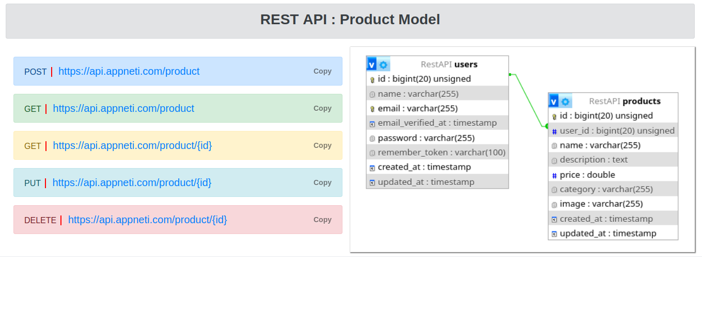

## PROJECT AIM TO

- Make data available for REST API data manipulation.
- Enable user in testing purpose, easy Learning and working with in their projects
- Gain experience in buildig and manage huge dataset that is useful to the people
- Made for native apps and web

## Contributing

To be the contributor in this project  [Click Me to Send the Email ](mailto:ictechnology26@gmail.com).

## GET STARTED
- Clone this project 
- cp .env.example .env
- composer update
- npm install
- php artisan migrate
- php artisan serve

## License

The Laravel framework is open-sourced software licensed under the [MIT license](https://opensource.org/licenses/MIT).

